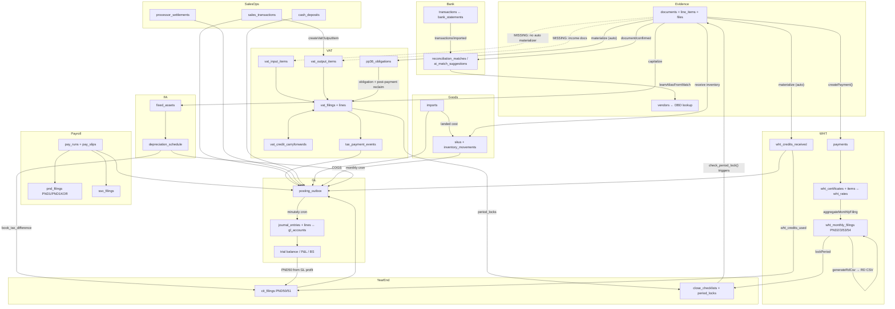

# Thai Accounting Structure Map

How Long Dtua models the facets of Thai accounting, which tables/modules own each
facet, and how data flows between them. Verified against code on 2026-07-02
(post-hardening merge). Companion to `reconciliation-architecture.md`.

Use this doc to answer: "where does X live?", "what feeds Y filing?", and
"is this edge wired or manual?"

Interactive visual version: `docs/accounting-structure-map.html` (open in a
browser — hover a facet to trace its flows, click for tables/code/pages/gaps).

---

## 1. Facet catalog

Each facet: domain purpose → tables → compute → pages → outputs.

### 1.1 Document capture & AI extraction (evidence layer)

Every Thai tax position must trace to a source document (tax invoice/ใบกำกับภาษี,
receipt, credit/debit note, received 50 tawi). Documents are classified by
`tax_invoice_subtype` (`full_ti`, `abb`, `e_tax_invoice`, `not_a_ti`) because only
full/e-tax invoices support input-VAT claims.

- **Tables:** `documents` (snapshots: `supplier_tax_id_snapshot`,
  `buyer_branch_number_snapshot`, `tax_invoice_serial_number`; `vat_treatment` CHECK ∈
  `no_vat|input_vat|output_vat|exempt|not_claimable|pp36`; `vat_period_year/month`,
  `vat_establishment_id`, `ai_confidence`, `needs_review`), `document_line_items`
  (per-line `wht_rate NUMERIC(5,4)`, `wht_amount`, `rd_payment_type_code`),
  `document_files` (pipeline status `uploaded→extracting→validating→validated→completed|failed_*`),
  `vendors` (unique `(org_id, tax_id, branch_number)`, `entity_type` ∈
  `individual|company|foreign`, DBD verification columns).
- **Compute:** `src/lib/inngest/functions/process-document.ts` (event
  `document/uploaded`; quality-check → vendor probe → extraction context →
  `generateObject` with model escalation + $0.50/doc budget → validate → vendor
  lookup → WHT classification via `lookupWhtRate` against `wht_rates` → store).
  `src/lib/ai/extract-document.ts`, `src/lib/ai/schemas/`. DBD enrichment:
  `src/lib/api/dbd-client.ts`.
- **Learning loop:** `extraction_exemplars`, `vendor_tier`, `extraction_log`,
  `extraction_correction_sessions`, `extraction_learning_candidates`,
  `exemplar_consensus`, `extraction_compiled_patterns` and the Inngest chain
  (`review-saved-handler`, `review-confirmed-handler`, `consensus-recompute` cron,
  `compile-vendor-pattern`, `shadow-validate-pattern`, `shadow-canary`).
- **Pages:** `/documents/upload`, `/documents/expenses`, `/documents/income`,
  `/documents/[docId]/review`, `/capture`, `/admin/extraction-health`.
- **Outputs:** none directly — feeds everything downstream.

### 1.2 Bank statements & reconciliation

Match bank money movement to documents/payments — the basis for "was this invoice
actually paid".

- **Tables:** `bank_accounts`, `bank_statements` (opening/closing balance
  validation), `transactions` (`external_ref` dedup, `reconciliation_status`),
  `reconciliation_matches` (`match_type`, `matched_by`, `confidence NUMERIC(3,2)`,
  soft-delete), `ai_match_suggestions`, `vendor_bank_aliases` (auto-confirm at
  3 occurrences), `reconciliation_rules`, `ai_batch_runs`.
- **Compute:** parsers `src/lib/parsers/` (KBank CSV/PDF, generic CSV, balance
  validation); `src/lib/reconciliation/matcher.ts` `findMatches()` 7-layer cascade
  (reference → alias → exact → rule → multi-signal → split → ambiguous). Inngest:
  `reconcile-document.ts` (on `document/confirmed`), `match-imported-transactions.ts`
  (on `transactions/imported`, ±45-day candidate window), `suggest-rules.ts`,
  `ai-reconciliation-dispatcher.ts` (hourly) → `ai-reconciliation-batch.ts`
  ($1/mo budget in `org_ai_settings`).
- **Pages:** `/bank-accounts` (+ upload), `/reconciliation` (+ review, ai-review,
  insights), `/settings/reconciliation-rules`.
- **Outputs:** monthly reconciliation PDF via `/api/reconciliation-summary`
  (`src/lib/pdf/reconciliation-summary.tsx`).

Full detail: `reconciliation-architecture.md`.

### 1.3 WHT at source — 50 tawi certificates & PND 2/3/53/54

Thai payers withhold tax on service payments, issue a **50 tawi**
(หนังสือรับรองการหักภาษี ณ ที่จ่าย) to the payee, and remit monthly: **PND3**
(individuals, §40(5)–(8)), **PND53** (Thai companies), **PND54** (foreign
entities), **PND2** (dividends/interest). e-WHT reduced rates supported.

- **Tables:** `payments` (`gross_amount`, `wht_amount_withheld`, `net_amount_paid`),
  `wht_certificates` (unique `(org_id, certificate_no)`, `form_type` enum, payer/payee
  snapshots, status `draft|issued|voided|replaced`), `wht_certificate_items` (FK to
  `documents` + `document_line_items`), `wht_sequence_counters` (per org/form/year,
  never deleted), `wht_monthly_filings` (unique `(org, period, form_type)`, status
  `draft|filed|paid`), `wht_rates` (global, effective-dated),
  `wht_annual_threshold_decisions` (฿1,000 annual threshold).
- **Compute:** `createPayment()` (`src/lib/db/queries/payments.ts`) — one
  transaction: payment insert → `createWhtCertificateDraft()` (form type via
  `getFormTypeForEntity`, sequence via `allocateSequenceNumber`) → satang-exact
  WHT/net adjustment → `materializePp36ObligationFromDocument()`. Filing:
  `src/lib/db/queries/wht-filings.ts` (`aggregateMonthlyFiling`, `markFilingAsFiled`
  — sets `period_locked` and inserts `period_locks`). Foreign: `src/lib/tax/foreign-wht.ts`,
  `service-categories.ts`.
- **Pages:** `/tax/wht-certificates` (= `/tax/withholding/outgoing`),
  `/tax/monthly-filings` (= `/tax/withholding/filings`), `/tax/withholding` (+ register).
- **Outputs:** 50 tawi PDF (`src/lib/pdf/fifty-tawi.tsx`, bilingual variant
  auto-selected for foreign payees); RD e-filing CSV (`src/lib/tax/rd-csv-export.ts`
  `generateRdCsv` — Thai headers, UTF-8 BOM + CRLF, Buddhist Era dates, filename
  `PND{n}_{BE-year}_{MM}.csv`).

### 1.4 WHT credits received (incoming 50 tawi)

Certificates customers withheld from the org's income = CIT prepayment credits.

- **Tables:** `wht_credits_received` (unique per certificate document and per
  `(customer, certificate_no, tax_year)`, CHECK `wht_amount <= gross_amount`).
- **Compute:** `src/lib/db/queries/wht-credits-received.ts` —
  `materializeWhtCreditReceivedFromDocument` auto-invoked from `confirmDocument`
  for `wht_certificate_received` documents; `getWhtCreditsReceivedTotal` feeds CIT.
- **Pages:** `/tax/wht-credits-received` (= `/tax/withholding/incoming`).
- **GL:** posting kind `wht_credit_received`.

### 1.5 VAT operations ledger — PP30 (ภ.พ.30) & PP36 (ภ.พ.36)

PP30 = monthly VAT return per VAT-registered establishment (branch-scoped, สาขา);
nil filing required monthly; input VAT claimable within 6 months, full/e-tax
invoice only. PP36 = reverse-charge self-assessment on foreign service payments
(org-level); reclaimable in PP30 only **after** PP36 remittance. Credit positions
carry forward.

- **Tables:** `tax_treatment_decisions` (AI classification, review status),
  `vat_input_items` (status machine `needs_review→awaiting_tax_invoice→claimable→allocated_to_draft→filed`
  + `held|do_not_claim|expired|voided_by_amendment`; full-TI CHECK; snapshot +
  sha256 hash; establishment required once claimable), `vat_output_items`
  (tax-point columns, same snapshot discipline), `pp36_obligations` (FX columns,
  CHECK `pp36_establishment_null_check` = org-level pool, CHECK
  `pp36_reclaim_requires_paid_check`), `vat_filings` (`pp30|pp36`,
  `ordinary|additional|amendment`, CHECK ordinary PP30 must have establishment),
  `vat_filing_lines` (append-only, frozen snapshots), `vat_credit_carryforwards`,
  `tax_payment_events` (idempotency-keyed), `tax_rule_versions`.
- **Compute:** `src/lib/db/queries/vat-operations-ledger.ts` — item creators,
  draft builders (`buildPp30VatFilingDraft`, `buildPp36VatFilingDraft`), line
  allocators (input/output/pp36/reclaim/carryforward), `markVatFilingDraftFiled`
  (BigInt-cent totals, net = output − input − pp36Reclaim − carryforwardIn, writes
  carryforward + `period_locks` + `audit_log`), `recordTaxPaymentEvent` (→ posting
  outbox). PP36 classification: `src/lib/tax/foreign-vendor-tax.ts` +
  `materializePp36ObligationFromDocument`. Effective-dated VAT rate:
  `src/lib/db/queries/tax-config.ts` `getVatRate()` over `tax_config`.
- **Pages:** `/tax/vat` (dashboard + build/file actions), `/tax/vat/{input,output,register,forecast}`,
  `/tax/vat/filings/[filingId]`.
- **Outputs (§87 statutory reports):** input tax report
  (`src/lib/tax/input-tax-report.ts` + `/api/tax/input-tax-report.csv`), output tax
  report (from `sales_transactions`), VAT register (`src/lib/tax/vat-register.ts` —
  reads **documents**, not the ledger; see Gaps), inventory movement report.

### 1.6 POS sales, processor settlements, cash deposits

- **Tables:** `sales_transactions` (`pos_primary|processor_shadow`, tax-base/VAT
  split, unique active tax-invoice number per org/establishment/terminal),
  `voucher_sales`, `processor_settlements` (fee-VAT requires processor tax invoice,
  DB CHECK), `cash_deposits` (variance tracking).
- **Compute:** `src/lib/db/queries/pos-sales-ledger.ts` — `createManualPosSale` /
  `importPosSalesCsv` call `createVatOutputItem` (the **only** production writer of
  `vat_output_items`) and enqueue GL posting.
- **Pages:** `/sales`. **GL kinds:** `pos_primary_sale`, `processor_settlement`, `cash_deposit`.

### 1.7 Imports (customs, import VAT, landed cost)

- **Tables:** `imports` (clearance date, FX at clearance, assessed duty/excise/import
  VAT), `import_documents`, `import_goods_lines`, `import_charge_lines`
  (`is_import_vat` requires `vat_period_override`), `import_payments`,
  `inventory_statutory_overhead_components` (landed-cost layers).
- **Compute:** `src/lib/db/queries/imports.ts` (finalization enqueues GL posting).
- **Pages:** `/imports`, `/imports/[id]`. **GL kinds:** `import_broker_invoice`,
  `import_payment_clearing`.

### 1.8 Inventory & COGS

- **Tables:** `skus` (valuation CHECK `weighted_average|fifo|specific_identification`,
  running qty/avg-cost/value, GL account links), `inventory_movements` (sign CHECKs,
  running-after columns, `journal_entry_id`), `inventory_counts` + items.
- **Compute:** `src/lib/db/queries/inventory.ts`, `src/lib/inventory/weighted-average.ts`.
- **Pages:** `/inventory` (+ skus, adjustments, counts); document review's
  `receiveDocumentInventoryAction` links purchase docs to `purchase_in` movements.
- **GL kinds:** `inventory_purchase`, `inventory_cogs`, `inventory_sale_cogs`,
  `inventory_count_variance`.
- **Outputs:** roll-forward + aged CSVs (`/api/inventory/*.csv`).

### 1.9 Fixed assets & depreciation (Royal Decree 145 tax lives)

- **Tables:** `fixed_assets` (category CHECK, book vs `tax_useful_life_months_minimum`,
  GL account triple, disposal columns), `tax_min_life_by_category` (global, cited),
  `depreciation_schedule` (unique per asset+period, `tax_depreciation_capped_amount`,
  `book_tax_difference`, `journal_entry_id`), `fixed_asset_depreciation_periods`.
- **Compute:** `src/lib/db/queries/fixed-assets.ts` (schedule builder, monthly
  processor, disposal, roll-forward). Cron `process-monthly-depreciation`
  (1st of month) → outbox → JE kind `depreciation`.
- **Pages:** `/fixed-assets` (+ [id]/dispose, import, reports); document review's
  `capitalizeDocumentAsFixedAssetAction`.
- **CIT tie:** `syncFixedAssetDepreciationBookTaxAdjustment` rolls
  `book_tax_difference` into `book_tax_adjustments` for PND50.

### 1.10 General ledger & financial statements

- **Tables:** `gl_accounts` (Thai 4-digit code CHECK, `name_th/name_en`,
  `vat_register_role`, `wht_register_role`, `dbd_taxonomy_hint`), `journal_entries`
  (balanced CHECK, `entry_type` incl. `auto_*` kinds, idempotency unique, reversal
  linkage, **no soft-delete** — reversal-only), `journal_lines` (debit XOR credit,
  subledger refs, cost center/project segments), `gl_opening_balances`,
  `posting_outbox` (unique per source entity+event, status machine),
  `posting_exceptions`, `cost_centers`, `projects`, `allocation_rules`.
- **Compute:** `src/lib/db/queries/general-ledger.ts` (COA seed, journal creation,
  reversal, per-kind posters, `buildTrialBalance`, `buildFinancialStatementSummary`),
  `src/lib/db/queries/posting-outbox.ts` (enqueue/drain/cron, GL period locking),
  dispatch table `src/lib/gl/posting-kind-dispatch.ts` (14 source:event → kind
  mappings). Cron `process-posting-outbox` every minute.
- **Pages:** `/accounting` (+ journal, posting-exceptions, reports/*), `/analytics/*`.
- **Outputs:** trial balance / P&L / balance sheet / GL detail CSVs
  (`/api/accounting/*.csv`).

### 1.11 Multi-currency / FX (BOT rates)

- **Tables:** `fx_rates_bot` (unique `(rate_date, currency)`), `fx_valuation_layers`
  (monetary item chains, `journal_entry_id`).
- **Compute:** `src/lib/analytics/fx-revaluation.ts`, `src/lib/integrations/bot/`.
  Crons: `fetch-bot-fx-rates` (weekdays), `process-month-end-fx-revaluation`
  (1st of month). JE kind `fx_revaluation`.
- **Pages:** `/analytics/fx-rates`.

### 1.12 Payroll — PND1 / PND1 Kor / SSO (ประกันสังคม)

PND1 = monthly employer PIT withholding on salaries (§40(1)/(2)); PND1 Kor =
annual summary; SSO = social security contributions (employee + employer, capped).

- **Tables:** `employees` (SSO eligibility, prior-employer YTD), `employee_allowances`
  (per-tax-year PIT deduction declarations), `pay_runs` (status machine), `pay_slips`
  (`pnd1_income_type` CHECK `40_1|40_2`, PIT/SSO/provident columns, links to bank
  txn + WHT cert + filing), `pnd_filings` (form CHECK incl. `PND1|PND1KOR`, status
  `draft|submitted|accepted|rejected`), `sso_filings`, reference tables
  `pit_brackets`, `pit_standard_deductions`, `sso_config` (effective-dated, cited).
- **Compute:** `src/lib/payroll/pit-calculator.ts` (cumulative-YTD monthly PIT),
  `sso-calculator.ts`; `src/lib/db/queries/payroll.ts` (draft run → approve →
  pay → `buildPnd1Draft` / `buildPnd1KorDraft` / `buildSsoFilingDraft` →
  remittance recording with GL posting).
- **Pages:** `/payroll` (+ employees/allowances, runs, filings/pnd1, pnd1-kor, sso).
- **GL kinds:** `payroll_net_payment`, `payroll_pnd1_remittance`, `payroll_sso_remittance`.
- **Outputs:** none file-based yet (no payslip PDF, no RD/SSO e-filing file — see Gaps).

### 1.13 Corporate income tax — PND51 / PND50 + transfer pricing

PND51 = semi-annual CIT prepayment (projected or actual-H1); PND50 = annual CIT
from accounting profit ± book-tax adjustments − loss carry-forward (5-year max) −
WHT credits; SME progressive brackets vs standard 20%; TP disclosure above
revenue threshold.

- **Tables:** `cit_brackets`, `cit_filings` (`pnd51|pnd50`, profit/adjustment/loss
  columns, `pnd51_method` CHECK, amendment uniques), `book_tax_adjustments`
  (`add_back|deduct`), `loss_carry_forward_layers` (CHECK expiry = origin + 5,
  remaining ≤ original), `transfer_pricing_disclosures`.
- **Compute:** `src/lib/cit/cit-calculator.ts`; `src/lib/db/queries/cit-filings.ts`
  (`buildPnd50DraftFromGlProfit` reads GL P&L; adjustment syncers for depreciation
  and entertainment cap; loss consumption/expiry; submit/accept; TP requirement
  refresh).
- **Pages:** `/year-end/cit`. **GL kinds:** `cit_accrual`, `cit_payment`, plus
  year-end close kinds via `postYearEndCloseJournalEntries`.

### 1.14 Period close & locking

- **Tables:** `close_checklists` + items (per org/establishment/period),
  `period_locks` (org + optional establishment + free-text domain + period,
  lock/unlock audit columns).
- **Compute:** `src/lib/db/queries/close-checklists.ts`, `period-locks.ts`
  (`isPeriodLocked`, `lockPeriod`); DB function `check_period_lock()` + guard
  triggers (migrations 0016, 0031, 0035); override session var
  `app.lock_override_user_id`.
- **Pages:** `/close`, `/accounting` (GL lock action).
- **Canonical spec:** `period-lock-protocol.md` (code partially conforms — see Gaps).

### 1.15 Compliance calendar & reference config

- **Tables:** `tax_config` (effective-dated key/value: VAT rate, deadline days),
  `thai_business_calendar` (holiday reference — currently unread; see Gaps).
- **Compute:** `src/lib/tax/filing-deadlines.ts` (paper 7th / e-filing deadlines,
  `adjustToNextThaiBusinessDay` over hardcoded 2026/2027 holiday lists, Bangkok
  TZ-safe), `filing-calendar.ts`, BE utilities `src/lib/utils/thai-date.ts`.
- **Pages:** `/tax/calendar`, dashboard deadline widgets.

### 1.16 Cross-cutting system facets

`audit_log` (immutable), `exception_queue`, `org_ai_settings`, copilot
(`copilot_*` tables with risk levels), org/membership/establishment model
(org: 13-digit `tax_id`, `branch_number` default `00000`, VAT registration flag;
`establishments`: branch CHECK `^(00000|[0-9]{5}|UNKNOWN)$`, head-office flag).

**Accounting-package exports:** `src/lib/export/` — FlowAccount (Thai headers, BE
dates), Peak (Gregorian, dashed tax IDs), full data export (~55 tables, JSON+CSV,
AI keys redacted) — all from `/reports`.

**TFRS for NPAEs / DBD e-filing:** documentation only (`tfrs-npaes-notes-spec.md`,
`dbd-tfrs-cpa-handoff.md`, `dbd-template-spec.md`); no XBRL/DBD workbook code
exists; the only schema hook is `gl_accounts.dbd_taxonomy_hint`.

---

## 2. Data-flow spine

### (0) Capture → extraction → confirm

1. Upload → blob + `documents` (draft) + `document_files` (`uploaded`) → Inngest
   **`document/uploaded`**.
2. `process-document.ts` → extraction columns on `documents`,
   `document_line_items` (WHT rates resolved from `wht_rates`),
   `document_files.pipeline_status='completed'`, `extraction_log`.
3. Human confirm (`/documents/[docId]/review`) → one transaction:
   `confirmDocument()` (+ auto-materialize `wht_credits_received` for received
   50 tawi docs) + `materializePp36ObligationFromDocument()` → emits
   **`document/confirmed`** + learning events (fire-and-forget).

### (a) VAT chain

- **PARTIALLY MISSING EDGE:** confirmed domestic documents → `vat_input_items` /
  `vat_output_items`. `createVatInputItem` has **no production caller** (tests +
  e2e harness only); `createVatOutputItem` is called only by POS sales. Domestic
  document VAT does not auto-materialize into the ledger; `/tax/vat/register`
  instead reads `documents.vat_period_*` + `vat_treatment` directly.
- **PP36 (fully wired):** foreign-service docs → `pp36_obligations` (on confirm
  and on payment) → PP36 draft + lines → filed → paid (`pp36_paid_at`) →
  `eligible_for_pp30_reclaim` → next PP30 draft picks it up as a `pp36_reclaim`
  line. Premature reclaim impossible: DB CHECK `pp36_reclaim_requires_paid_check`.
- **PP30 filing:** draft builder (branch-scoped, DB-enforced) ← claimable input
  items + reportable output items + carryforward → `markVatFilingDraftFiled`
  freezes items, computes net in BigInt cents, writes carryforward on credit,
  `period_locks(domain='vat_pp30')`, `audit_log`.
- **Payment → GL:** `recordTaxPaymentEvent` → `tax_payment_events` →
  `posting_outbox` → minutely cron → `postTaxPaymentEventJournalEntry`.

### (b) WHT chain

Payment recording → `createPayment` → certificate draft (+items FK back to
document lines) → PDF (50 tawi, bilingual for foreign) → monthly aggregation into
`wht_monthly_filings` → `markFilingAsFiled` (locks period) → `generateRdCsv` for
RD e-filing. Deadlines from `tax_config` day-of-month + Thai business-day
adjustment.

### (c) Bank ↔ reconciliation

Statement upload → parser + balance validation → `transactions` (deduped) →
**`transactions/imported`** → deterministic match pass (±45-day window) →
leftovers to hourly AI batch → `ai_match_suggestions` → human review →
alias learning → rule suggestions. Bank transactions also settle filings
directly via `*_transaction_id` FKs on `vat_filings`, `tax_payment_events`,
`pnd_filings`, `sso_filings`, `cit_filings`, `pay_slips`, `sales_transactions`,
`processor_settlements`, `cash_deposits`, `import_payments`.

### (d) GL posting → statements → CIT

Universal pattern: domain write + `enqueuePostingOutbox` in the same transaction →
minutely cron → dispatch table → balanced `journal_entries` (idempotent) →
failures to `posting_exceptions`. Wired sources: WHT credits, tax payments, POS
sales, settlements, deposits, import charges/payments, inventory movements, CIT
accrual/payment, payroll (net pay, PND1, SSO), depreciation.
**Not wired: ordinary purchase/sales documents and their payments** — expense
docs reach the GL only via inventory/import flows (see Gaps). Year-end:
`postYearEndCloseAction` → revenue summary → retained earnings;
`buildPnd50DraftFromGlProfit` reads GL profit for CIT.

### (e) Payroll

Employees + allowances → draft run (cumulative-YTD PIT, capped SSO) → slips →
approve → pay (GL) → PND1 draft aggregates slips → remittance (GL); annual
PND1 Kor; SSO filing → remittance (GL).

### (f) Fixed assets

Document capitalization → asset → depreciation schedule (book vs RD-145-capped
tax) → monthly cron posts JEs → `book_tax_difference` syncs into
`book_tax_adjustments` → PND50. Disposal posts gain/loss.

### (g) Inventory

Purchase docs / imports (landed cost) → movements (weighted-average state on
`skus`) → COGS JEs → P&L → CIT.

---

## 3. Interconnection diagram

---

## 4. Guardrails (cross-cutting invariants)

1. **Multi-tenancy.** `org_id NOT NULL` on every business table; `orgScope()` /
   `orgScopeAlive()` in the query layer; `enforce_same_org_reference()` DB
   triggers on cross-table FKs; composite `(id, org_id)` uniques for org-safe
   joins. Tested by `org-isolation.db.test.ts`.
2. **Establishment (branch) scoping.** PP30 ordinary filings must be
   branch-scoped (DB CHECK); VAT items require establishment once
   claimable/reportable; PP36 is an org-level pool (`establishment_id` forced
   NULL — never filter it by branch). Payroll/sales/inventory rows carry
   establishment columns.
3. **Period locks.** `period_locks` + `check_period_lock()` triggers on
   documents, WHT certificates/filings, VAT items/filings/lines/carryforwards,
   tax payment events, journal entries/lines. Locks written on VAT filing, WHT
   filing, and GL lock actions — each with an audit entry.
4. **Soft delete.** `deleted_at` everywhere, with deliberate exceptions:
   `audit_log` (immutable), `wht_sequence_counters`, effective-dated reference
   tables, `journal_entries`/`journal_lines` (reversal-only), `vat_filing_lines`
   (append-only).
5. **Audit trail.** `auditMutation` helper (fire-and-forget) + inline audit
   inserts at filing-critical moments; copilot tool events carry risk levels.
6. **Money discipline.** `NUMERIC(14,2)` amounts, `NUMERIC(5,4)` rates; integer
   satang (`src/lib/utils/money.ts`) or BigInt cents (VAT ledger) arithmetic;
   balanced-entry and debit-XOR-credit CHECKs.
7. **AI suggests, humans confirm.** `needs_review` defaults true; extraction
   never auto-confirms; ambiguous matches never auto-pick; learning patterns go
   candidate → shadow → active; below-statutory WHT rates need explicit
   acknowledgment.
8. **Idempotency.** Inngest steps wrap writes; unique idempotency keys on
   extraction log, posting outbox, auto journal entries, tax payment events;
   dedup on imported transactions and sales.
9. **PP36/PP30 separation.** Distinct line types; DB CHECK chain means PP36 VAT
   enters PP30 only as a post-payment `pp36_reclaim` line — structural, not
   conventional.
10. **Snapshot immutability.** sha256-hashed source snapshots on VAT items;
    frozen snapshots on filing lines — filed numbers survive later source edits.

---

## 5. Gaps & ambiguities (verified 2026-07-02)

1. **Documents → VAT ledger edge missing (biggest).** `createVatInputItem` has
   zero production callers; `createTaxTreatmentDecision` likewise. Two parallel
   VAT sources of truth: `documents.vat_treatment/vat_period_*` (drives
   `/tax/vat/register`) vs the operations ledger (drives PP30 drafts and the
   statutory input-tax report). Product decision pending on the materialization
   trigger (on confirm? on review? batch?).
2. **Ordinary documents/payments never post to GL.** No `documents:*` /
   `payments:*` outbox events; non-inventory expense docs and AR/AP are absent
   from the GL, so `buildPnd50DraftFromGlProfit` undercounts expenses unless
   manual journals are entered. AR/AP aging works off documents, not GL control
   accounts.
3. **`pnd_filings` migration protocol unimplemented.** The 4-state dual-write
   flag from `pnd-filings-migration-protocol.md` doesn't exist; `pnd_filings`
   holds only payroll forms while PND2/3/53/54 live in `wht_monthly_filings`.
4. **Period-lock protocol drift.** Protocol domains `vat|wht|gl|payroll|cit|sso`
   vs code's `vat_pp30|vat_pp36`; many source tables from the protocol's trigger
   list lack lock triggers (sales, inventory, payroll, CIT, transactions,
   payments, matches…); `wht_monthly_filings.period_locked` boolean survives
   despite the protocol's anti-pattern note; two `isPeriodLocked`
   implementations coexist; `period_locks.domain` is free text; migration 0016
   still references dropped `vat_records`.
5. **TFRS/DBD financial statements: docs only.** No XBRL/DBD workbook generator;
   `/year-end/cit` copy mentions an "auditor ZIP" with no backing code.
6. **Payroll output gap.** No payslip PDF, bank transfer file, or RD/SSO
   e-filing file; RD CSV export covers only certificate-based forms.
7. **PND54 ↔ PP36 unlinked.** Same foreign payment materializes both records
   independently; no cross-reference between the PND54 remittance and the PP36
   obligation.
8. **Amendment FKs untyped** on `pnd_filings`/`sso_filings`/`cit_filings`
   (`amends_filing_id` bare uuid); amendment workflow implemented only on the
   VAT side.
9. **Dual holiday sources.** `thai_business_calendar` table exists but
   `filing-deadlines.ts` uses hardcoded holiday arrays; nothing reads the table.
10. **Fire-and-forget event emission.** `confirmDocumentAction` and statement
    import emit Inngest events with `void send().catch(log)` — a failed emit
    silently skips reconciliation/learning (no `exception_queue` entry).
11. **Close checklist not wired to locks.** Checklist completion doesn't insert
    `period_locks`; GL locking is a separate manual action; the protocol's
    domain interaction matrix has no implementation.
12. **Glossary drift.** `_glossary.md` describes period locking pre-dating the
    `period_locks` table; `reconciliation-architecture.md` is accurate.
